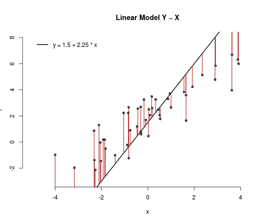
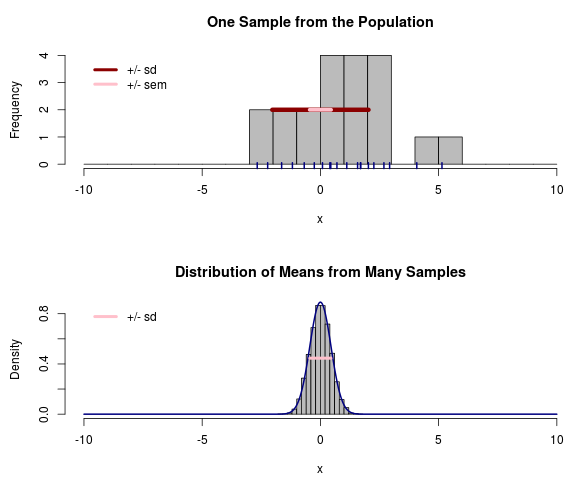
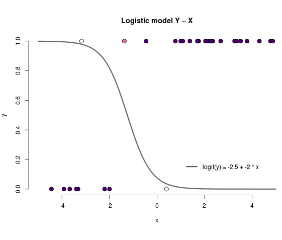

Statistical Theory, Models, and Methodology
======================================================

Instructor:	  	  
~~~~~~~~~~~~

Ewart Thomas

2015 Teaching Assistants:
~~~~~~~~~~~~~~~~~~~~

Steph Gagnon & Dan Hawthorne

Contents
--------

.. toctree::
   :maxdepth: 1

   data/index.rst
   slides/index.rst
   plots/index.rst
   apps/index.rst
   tutorials/index.rst
   cheatsheets/index.rst
   section/index.rst
   
