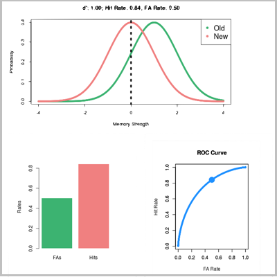
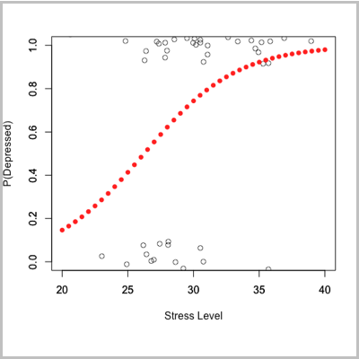
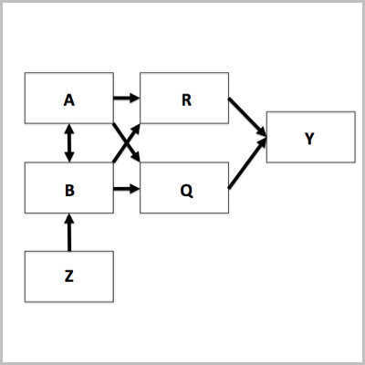

Statistical Theory, Models, and Methodology
======================================================

    
This course will review the more familiar procedures covered in Psych 252, namely, 
the general linear model (``lm {stats}`` in R), the generalised linear model 
(``glm {stats}``), and linear mixed models (``lme {nlme}``, ``lmer {lme4}``). 
Also, we will consider less familiar applications of these R functions, and more 
‘advanced’ procedures, such as, reliability, factor analysis, penalized regression, 
and structural equation modeling. [`Syllabus <http://www.stanford.edu/class/psych253/slides/253syll.pdf>`_]

Instructor:	  	  
~~~~~~~~~~~~

Ewart Thomas (ethomas)
	- Office Hours: Jordan 476, TTh 10 am

2015 Teaching Assistants:
~~~~~~~~~~~~~~~~~~~~

Steph Gagnon (sgagnon)
	- Office Hours: Jordan 404, by appt

Dan Hawthorne (djthorne)
	- Office Hours: Jordan 330, by appt

Contents
--------

.. toctree::
   :maxdepth: 1

   section/index.rst
   data/index.rst
   slides/index.rst
   cheatsheets/index.rst
   plots/index.rst
   apps/index.rst
   tutorials/index.rst
   
   